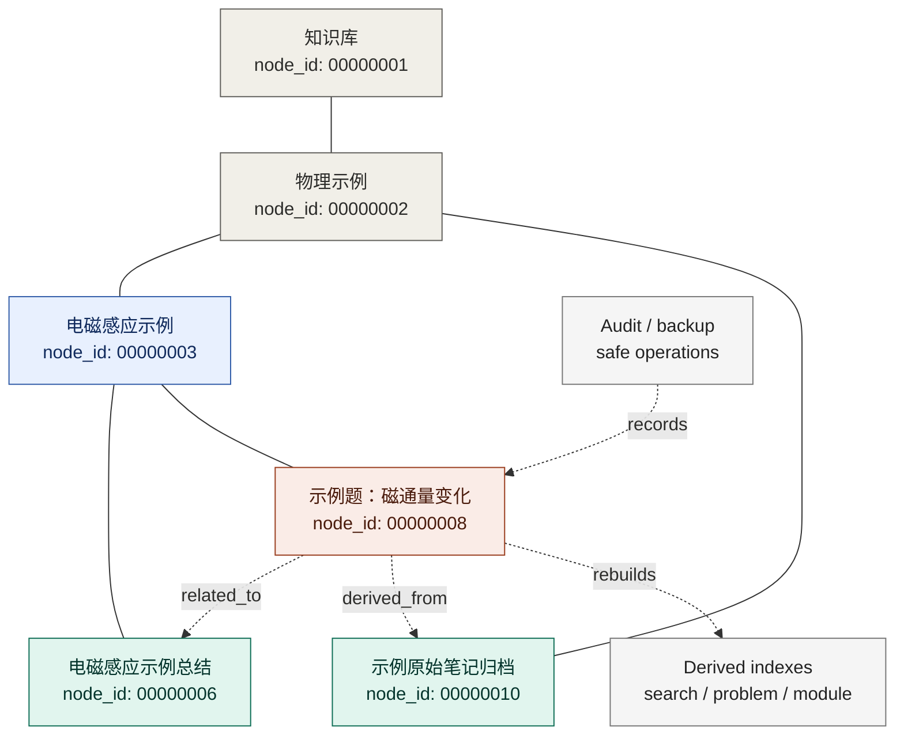

# KliniK 笔记系统 · KliniK Note System

## Quick Overview / 项目速览

KliniK 是一个把学习资料拆成“知识块”的个人知识系统。每条笔记都有稳定身份，可以被重新分类、移动、关联和深化，而不会丢失链接或历史。当前公开版本已经实现节点图、正文管理、安全操作和分类建议流原型；更深入的 AI 提取与内容深化仍属于后续方向。

KliniK is a graph-based knowledge-block note system for long-term learning materials. It replaces folders of Markdown files with stable nodes, one primary parent, and typed edges. The public snapshot includes graph management, managed content, safe operations and an AI-assisted classification workflow prototype; deeper AI extraction and note refinement remain future work.

> 当前公开仓库展示的是脱敏后的个人项目快照：不包含真实私人笔记、错题、原始归档、审计日志或备份。

## Why this project / 项目动机

普通笔记软件擅长记录文本，但学习资料的问题不只是“存下来”。真实学习过程中，一段原始笔记可能会逐渐拆成题目、知识点、错因、总结和复习提示；一个知识点可能关联多道题、多个来源和多次错误经验；人的分类判断也会随着理解深入而变化。

KliniK 的目标不是把 Markdown 包一层 UI，而是建立一套适合长期学习资料演化的结构：稳定的知识块身份、可调整的归属关系、可追溯的来源记录，以及由人工判断主导、AI 建议辅助的整理流程。

## Core ideas / 核心理念

### 知识块，而不是普通文件

系统把学习内容拆成节点。节点可以表示题目、知识点、模块总结、原始笔记或错题笔记。每个节点都有稳定 `node_id`，不依赖标题、目录或当前位置。

这样，笔记可以被重新分类、移动、拆分、关联，而不会丢失身份和历史。

### 主要归属与关系边并存

一个节点有唯一主要归属，用于默认导航、排序、权限继承和统计；同时也可以通过关系边连接到其他节点，表达来源、引用、关联、替代或快捷入口。

这使系统既保留树状结构的清晰性，又能表达真实学习中复杂的知识联系。

### 人的判断与 AI 建议共同进化

系统不会把 AI 当成自动改写和自动分类的权威。当前已经实现的是分类经验记录、指导摘要、未分类建议流原型：AI 建议以草稿形式导入，用户确认后才会真正移动节点。

后续 AI 能力会继续围绕“辅助理解”展开：从原始笔记中提取题干、卡点、错因、关键式子、破题点和可迁移结论，并保留来源、证据和置信度。

## Data model / 数据模型



- 实线 = 主归属 `primary_parent_id`，用于导航、排序和默认组织。
- Solid line = `primary_parent_id`, used for navigation, ordering and the default tree.
- 虚线 = 跨节点关系 `edges`，用于来源、引用、关联、替代等。
- Dashed arrow = typed `edges`, used for source, cites, related, supersedes, etc.
- 节点身份 = 稳定 `node_id`，改名或移动不会断链。
- Identity = stable `node_id`; renaming or moving does not break links.

## What is implemented / 当前能力

### Knowledge blocks and graph structure

- 全局稳定 `node_id`；
- `primary_parent_id` 表达主要归属；
- typed `edges` 表达来源、引用、关联和快捷入口；
- 任意有效节点原则上都可以拥有正文、子节点和关系边；
- 受管理正文与节点所有权绑定，避免同一内容被多个节点重复拥有。

### Safe graph operations

- 节点创建、改名、移动、批量移动、排序、归档、恢复、删除和合并；
- 危险操作先预览影响范围；
- 提交时校验 graph version hash，避免旧页面覆盖新修改；
- 操作前创建备份，操作后写入审计；
- 管理页面提供备份查看和恢复入口。

### Search and content editing

- Markdown / MDX 正文编辑；
- 内容哈希冲突检测；
- `manual_override` 人工编辑保护；
- 全文搜索只读取图系统登记的受管理内容；
- 项目文档、配置、备份和审计日志不会进入网页内容编辑器或普通搜索。

### AI-assisted classification workflow prototype

- 人工分类修正记录；
- 压缩分类指导摘要；
- 未分类内容任务包导出；
- AI 建议 JSON 导入；
- 建议进入待确认状态，接受或改判后才走现有移动预览、版本校验、备份和审计流程。

## How it differs from normal note apps / 与普通笔记系统的区别

普通笔记系统通常以文件、文件夹、标签或双链为核心。本项目更关注学习资料在长期使用中的演化过程。

- 它管理的是知识块，而不只是文本文件；
- 它允许内容归属和关系被持续调整；
- 它区分主要归属和跨节点关系，避免把所有联系都塞进单一目录结构；
- 它保留人工分类和修正经验，为后续建议提供上下文；
- 它强调草稿和建议必须经过人工确认；
- 它通过备份、审计、哈希保护和一致性检查，降低长期重构中的数据风险。

## Local setup / 本地运行

环境要求：

- Node.js LTS；
- pnpm。

安装依赖：

```powershell
pnpm install
```

初始化脱敏 demo 数据：

```powershell
pnpm run demo:init
```

如果本地已经存在真实数据，脚本会拒绝覆盖。仅在确认要覆盖为 demo 时使用：

```powershell
pnpm run demo:init -- --force
```

启动开发服务器：

```powershell
pnpm dev
```

打开：

```text
http://localhost:3000
```

常用检查命令：

```powershell
pnpm run graph:check
pnpm run graph:test
pnpm run test:ui-content
pnpm run stage-b:test
pnpm run build
```

## Demo data / Demo 数据

仓库包含 `demo-data/`，用于生成一套最小脱敏样例：

- 10 个节点；
- 3 条跨节点关系；
- 2 个模块容器；
- 2 张示例题目卡；
- 1 份原始笔记归档；
- 示例分类摘要和建议流记录。

这套数据可用于演示搜索、节点页面、管理页面和未分类建议流。真实私人数据目录在 `.gitignore` 中被排除，不会进入公开仓库。

## Repository history and privacy / 仓库历史与隐私说明

公开分支 `showcase-public` 是私有开发仓库的一次压缩、脱敏快照，因此只有一个提交。私人开发历史中包含真实笔记、备份、审计日志和本地图数据，所以不会公开推送。本仓库用于展示架构与工程能力，不包含真实私人学习资料。

The public branch `showcase-public` is a squashed and desensitized snapshot of a private development repository, hence the single commit. The private history contains real notes, backups, audit logs and local graph data, so it is not pushed publicly. This repository showcases the architecture and engineering work without exposing private learning materials.

以下内容默认不提交：

- `content/private/` 真实笔记；
- `data/graph/` 本地图数据；
- `data/indexes/` 派生索引；
- `data/backups/` 备份；
- `data/corrections/classification-corrections.jsonl` 人工分类日志；
- `data/classification-trials/` 建议流试运行记录；
- `.env*` 环境变量文件。

## Roadmap / 后续计划

### 更多笔记导入

继续导入更多物理笔记，并逐步支持其他学科。导入时利用已有分类经验摘要，提高初步分类建议的效率与精准度，但最终仍由用户确认。

### AI 辅助分类

完善未分类内容的建议流，让 AI 根据历史人工分类经验提出候选归属、理由和置信度。系统记录用户接受、拒绝或改判的结果，用于评估建议是否真正变好。

### AI 辅助内容深化

从原始笔记中提取题干、卡点、错因、关键式子和破题点，生成带来源证据的解析草稿。草稿必须经过人工审核后才能成为正式内容。

### 复习卡压缩

在完整解析的基础上，生成更短的复习卡、一句话提示和迁移结论，使原始笔记、完整解析和复习材料之间可以相互追溯。

### 网络部署与权限扩展

未来可能扩展到网络环境，并引入 public/private 内容区分、多用户访问和更细粒度的权限控制。

## License

This project is released under the MIT License. See [LICENSE](LICENSE) for details.
